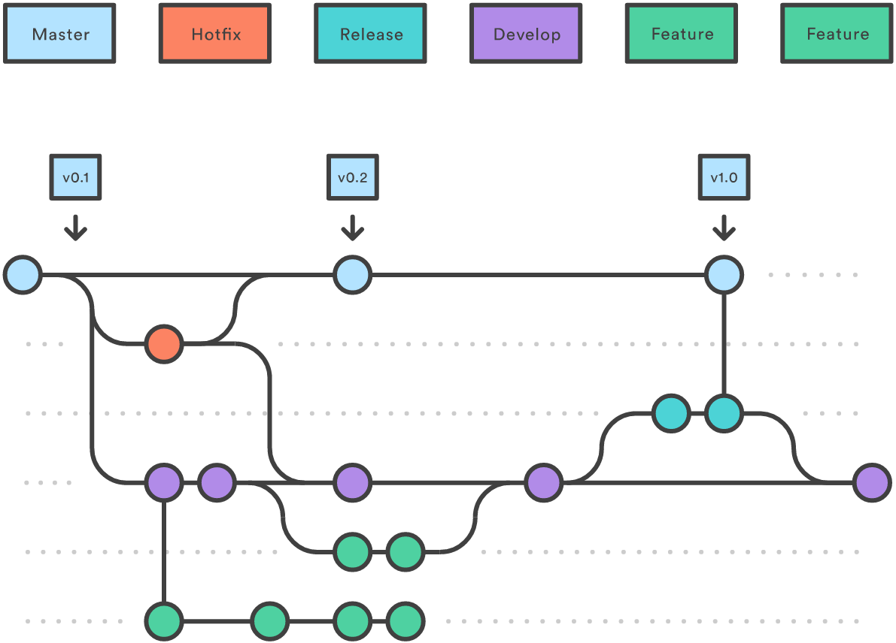

## GitFlow ##

Gitflow is a development workflow using git and several pre-defined branches, originally given by "VINCENT DRIESSEN".

The idea of this one is to have separate branches reserved for specific parts in development:
### Master :
This branch is always the most recent production code. Experimental code does not belong here.

### develop :
This branch contains all of the latest development. These developmental changes can be pretty much anything, but larger features are reserved for their own branches. Code here is always worked on and merged into release before release / deployment.

### hotfix :
This branches are for minor bug fixes, which cannot wait until the next release. hotfix branches come off of master and are merged back into both master and develop.

### release :
This branches are used to release new development from develop to master. Any last minute changes, such as bumping version numbers, are done in the release branch, and then are merged back into master and develop. When deploying a new version, master should be tagged with the current version number for future reference and easy rollback.

### feature :
This branches are reserved for bigger features. These are specifically developed in designated branches and integrated with develop when finished. Dedicated feature branches help to separate development and to be able to deploy done features independently from each other.

